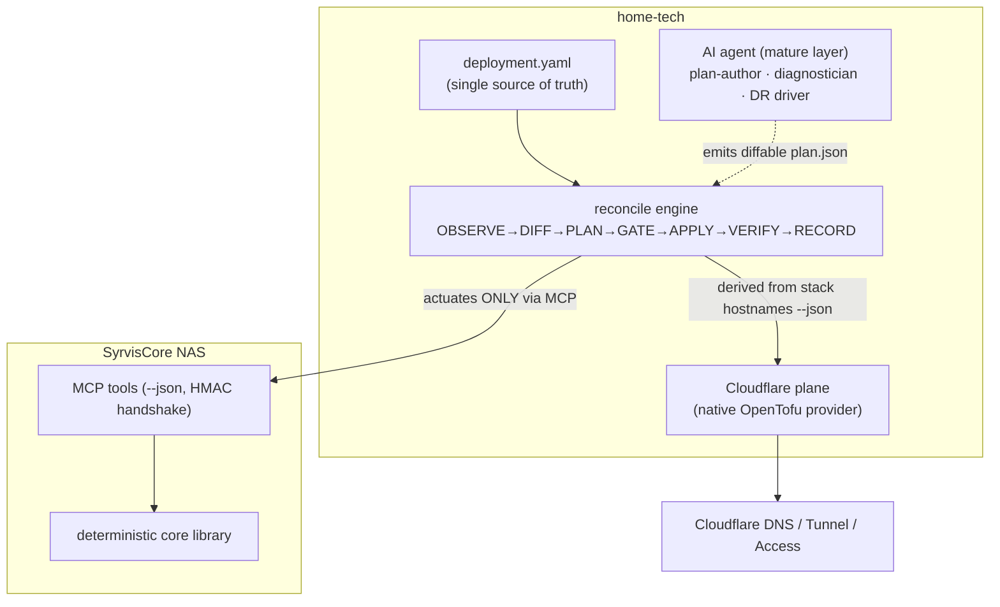
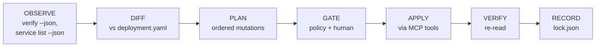
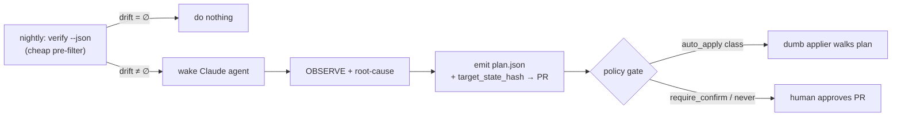

# Feature Requirement: Reliable Provisioning of the SyrvisCore Architecture (home-tech)

**Status:** Proposed · **Audience:** home-tech maintainers + SyrvisCore core
**Date:** 2026-07-11 · **Companion:** [wiki/04 Split DNS](wiki/04-split-dns.md), [mcp-design.md](mcp-design.md)

---

## 1. The question

home-tech must reliably and reproducibly provision the *entire* SyrvisCore architecture end to end:

- **(a) install / DR** — SyrvisCore onto a fresh or rebuilt NAS (SPK → `syrvisctl install` → `syrvis setup` → `syrvis start`), or restore-from-backup;
- **(b) drift correction** — detect and fix when the NAS diverges from desired (container down, wrong image, missing route, stale static config, a disabled service still running);
- **(c) Layer 2 services** — converge the NAS to run *exactly* the declared set of user services;
- **(d) networking** — the macvlan / shim / `TRAEFIK_IP` / subnet config;
- **(e) cloud services** — the Cloudflare side: Tunnel ingress hostnames, Access policies, and DNS records (A for `internal`, CNAME for `tunnel`).

The strategic question the team raised: **should this be Terraform? Ansible? something custom? and given how capable AI now is, what is the modern best approach to configuration management for a small-but-critical single-node homelab?**

## 2. TL;DR recommendation

**Build home-tech as a small custom *declarative reconciler* over the SyrvisCore MCP `--json` seam, add an *AI-agent layer* for plan authoring / drift diagnosis / DR, and use a native Terraform/OpenTofu Cloudflare provider for the *cloud plane only*.**

Do **not** put Terraform or Ansible in charge of the NAS side. SyrvisCore already ships ~80% of a config-management system — a tested drift model (`drift.py`/`verify.py`), typed `--json` reads, and an MCP whose two-call HMAC handshake *produces a read-only plan on the first (no-token) call*. That gives you a **side-effect-free dry-run by construction, from the same code path that applies** — a safety property Terraform's separate plan/apply can't match. Re-modelling all of that in a foreign tool would fight an impedance mismatch (coarse `syrvis` converge-verbs vs attribute-level CRUD) and run mutations through a *second, less-safe* privileged path.

This was the ranked outcome of a four-way design panel (declarative-over-MCP > AI-reconciler > Terraform > Ansible) scored on reliability, reproducibility, operator toil, AI leverage, and architectural fit. The winner scored **10/10 on architectural fit** precisely because it leans into the seam that already exists.



## 3. Why not pure Terraform or Ansible

Both are excellent tools misapplied to the NAS side here:

- **Terraform on the NAS** needs a custom `terraform-provider-syrviscore` (real Go code to maintain) that must map declarative attribute CRUD onto `syrvis`'s coarse "converge on next start" verbs — a genuine impedance mismatch. It also introduces `tfstate` as a *second* source of truth that drifts from the real NAS, and routes mutations through a new privileged path instead of the audited MCP one.
- **Ansible on the NAS** is the most self-aware about its own biggest risk: **thin-wrapper redundancy.** SyrvisCore *already* owns idempotency, so Ansible roles would mostly `command:` out to `syrvis … --json` and re-check — reimplementing convergence the core already does, again through a parallel sudo path.

**Terraform *is* the right tool for the Cloudflare plane** — clean API, an official `cloudflare` provider, real drift detection, no custom code — and that is exactly where the recommendation keeps it.

## 4. The desired-state model

One human-edited file in home-tech is the single source of truth (git-versioned, reviewable):

```yaml
# deployment.yaml
instance:   { domain: konsume.org, ssh_target: nas, traefik_ip: 192.168.8.4, version: 0.3.2 }
network:    { subnet: 192.168.8.0/24, macvlan_parent: ovs_eth0, shim_ip: 192.168.8.5 }
stack:
  dashboard:   { enabled: true, subdomain: dash, exposure: internal }
  cloudflared: { enabled: true }
services:
  cyberquill:  { image: ghcr.io/kevinteg/cyberquill:0.1.0, subdomain: bbq, exposure: tunnel, port: 8300,
                 on_absent: stop }          # stop | remove | purge — deletion policy, defaults to stop
cloudflare: { zone: konsume.org, tunnel: syrvis, access: { idp: google } }
```

Everything else — the Cloudflare records, the LAN A records, the running container set — is **derived** from this file plus what `syrvis stack hostnames --json` reports.

## 5. The reconcile engine

A few-hundred-line deterministic engine (`reconcile/engine.py`) with a fixed, load-bearing order:



Rules that make it safe and correct:

1. **Actuate exclusively via the MCP tools** — never raw SSH — so the allowlists, image-registry allowlist, forbidden-users, and the two-call HMAC handshake are inherited unchanged. One privileged seam.
2. **Fixed ordering** so records never point at nothing: `network/.env → install/version → core stack → L2 set → verify_fix →` *then read* `stack hostnames →` router-DNS (internal A) `→` Cloudflare (tunnel CNAME + ingress + Access).
3. **`--dry-run` is side-effect-free by construction**: the engine issues the *first* (no-token) call of every mutating MCP tool, which returns a server-minted plan, and stops there — it never echoes a confirmation token. A dry-run therefore *cannot* mutate, because it literally never makes the second call.
4. **Cloudflare/DNS strictly derived** from `stack hostnames --json` (which already emits `{type, target, proxied, access_required}` per host). `internal → A @ traefik_ip`; `tunnel → proxied CNAME + tunnel ingress + Access`. Stale records (present at the provider, absent from the report) are removed under the same deletion gate, identified by a `managed-by: syrvis` tag/comment convention.
5. **`lock.json`** records the last-applied resolved state + per-item digests for audit and rollback reference.

## 6. Exact SyrvisCore additions this requires

This is the **only** core growth — everything site-specific stays in home-tech, preserving the generic/private boundary.

| Addition | Why | Where |
|----------|-----|-------|
| **`syrvis stack apply --from <desired.yaml>`** — whole-set convergence: read the current core stack + L2 set, diff against the supplied desired doc, and add/recreate/remove to match, honoring a per-service deletion policy. Emit a structured `--json` plan (dry-run); gate the destructive subset behind the existing confirmation handshake. | The single highest-leverage addition and today's real gap: `stack apply` only regenerates compose from the on-NAS `stack.yaml`, and L2 changes are per-item `service_run`/`service_remove`. Whole-set convergence with safe deletion is domain logic about SyrvisCore's *own* resources, so it belongs in the library (shared by CLI, a new MCP `stack_apply_from` tool, and the dashboard). | `service_manager.py` + `stack.py`; new `cli.py`/MCP surface |
| **Extend `verify` to diff the L2 service set**, not just core drift | So full-set drift is one read. `verify`/`drift` cover core containers only today. | `verify.py` / `drift.py` |
| **Uniform `changed` / `no-op` field** in every mutator's `--json` envelope, and **stable machine-diffable drift-class identifiers** (e.g. `core_container_down`, `macvlan_shim_missing`, `stale_static_config`) | So `policy.yaml` can name safe auto-apply classes and a `target_state_hash` is well-defined. | across the `--json` surfaces |
| **Contract stability** — version/schema-freeze `verify`, `service list`, `stack list`, `stack hostnames` `--json` with a JSON schema + compatibility test | They are now the reconciler's de-facto API; apply the same pressure the MCP already applies to its command registry (mirror the `gen.py` drift test). | tests + a `schemas/` dir |

SyrvisCore still learns nothing about domains, IPs, tokens, or the service catalog.

## 7. The AI layer (mature phase)

AI is an **accelerant, never a dependency** — a deterministic `ssh nas && syrvis verify --fix` plus a written runbook must always be able to fully operate the node by hand.



- **Non-deterministic PLAN, deterministic APPLY.** The agent emits a *diffable* `plan.json` with a `target_state_hash`; a dumb applier walks the approved plan. The agent never self-approves — the confirmation token is server-minted and bound to args + target-state, and `purge`/`restore`/`reset`/`setup` aren't exposed to it.
- **`policy.yaml` tiers** — `auto_apply` (idempotent/reversible, e.g. starting a declared-down service, named-safe `verify_fix` classes), `require_confirm`, `never` — plus a `max_mutations_per_run` circuit breaker.
- **Cheap pre-filter** — run `verify --json` first; only wake the (costly) agent when drift ≠ ∅.
- **Where AI genuinely wins:** root-causing *correlated novel* failures a rules engine encodes badly (post-reboot: macvlan-shim missing → Traefik can't bind IP → 404s → cloudflared reports dead — and the *fix order* that untangles it), authoring `deployment.yaml` diffs from natural-language intent, narrating plans, and driving the branchy DR runbook.
- **Scheduled runs stay read-only.** On a critical single node, never cron-*apply*; cron only *detects* and opens a PR.

## 8. Disaster recovery is a gated path, not auto-heal

DR (`reconcile --bootstrap`) is explicit and human-gated — the SPK install and first `syrvis setup` are privileged/interactive and offline-with-cached-wheels; the loop must not pretend to self-heal an absent host. The agent can *drive* the runbook, but the SPK/setup steps require a human. See [wiki/06 Disaster Recovery](wiki/06-disaster-recovery.md) for the manual sequence this automates.

## 9. Phased plan

**MVP (build first, in home-tech):**
1. `deployment.yaml` as the single source of truth.
2. The deterministic reconcile engine actuating via MCP only, with the fixed ordering and side-effect-free dry-run.
3. Cloudflare/DNS derived from `stack hostnames --json` (a small provider module is fine for MVP).
4. `lock.json` for audit/rollback reference.
5. `reconcile --bootstrap` as the gated DR path.

**In parallel, in SyrvisCore:** ship `stack apply --from`, extend `verify` to L2, add the `changed`/drift-class honesty fields, and freeze the `--json` schemas with a compatibility test (§6).

**Mature (later):**
6. Add the AI agent layer (§7): nightly pre-filter, PR-based plans, `policy.yaml`, DR runbook driver.
7. Graduate the Cloudflare plane to a native OpenTofu provider with state encryption once its tunnel/Access resource shape is stable — Terraform's one clearly-right home.

## 10. Why this is the "modern, AI-era" answer

The instinct to reach for a heavyweight IaC tool is dated for a case like this. The modern move is: **keep a deterministic, typed, dry-runnable core (which SyrvisCore already is), drive it through one audited actuation seam (the MCP), and layer AI on top as a planner/diagnostician that emits deterministic artifacts a dumb applier executes.** You get IaC's reproducibility and auditable drift, the tunnel/Access plane handled by the tool that does it best (Terraform), and AI aimed at the one thing it's uniquely good at — reasoning about *novel, correlated* failure — without ever being a single point of failure or an unaudited hand on the controls.
