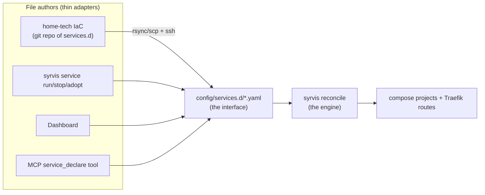

# Design: Declarative Service Loading (`services.d`)

**Status:** Proposed · **Audience:** SyrvisCore core + home-tech · **Date:** 2026-07-11
**Companion:** [service-declaration-v2.md](service-declaration-v2.md), [home-tech-provisioning-requirement.md](home-tech-provisioning-requirement.md), [wiki/05 Layer 2 Services](wiki/05-layer2-services.md)

## 1. The question

Some of the original design predates the decision to drive interactions through MCP via
home-tech. Two models are on the table for how new services get loaded:

- **Explicit interaction** — an operator (or the MCP, or the dashboard) issues an imperative
  command (`service run …`) and SyrvisCore mutates its state as a side effect.
- **A robust collection of YAML files** — SyrvisCore is *responsible for loading* a set of
  declaration files; if a non-critical service doesn't come up, it must not block the rest.

**Recommendation: the file collection is the substrate; every explicit interaction is sugar
that writes those files.** This is the same rule the codebase already lives by — *deterministic
core, thin adapters* — extended from *code* to *state*: the files are the interface, one
reconciler is the engine, and the CLI, dashboard, MCP, and home-tech's IaC are all just file
authors. It is IaC-native (a git repo of YAML is the natural home-tech shape), it works with
**zero MCP dependency** (rsync + `ssh nas syrvis reconcile` is a complete driver), and it keeps
the open-source CLI/dashboard paths first-class rather than second-class.

The explicit interactions stay — they're the right UX for a human adding one service — but they
stop being a *separate mechanism*. `service run gollum` becomes "write
`services.d/gollum.yaml`, then reconcile," which means anything a human does imperatively is
instantly visible to (and reconcilable by) the IaC layer, and vice versa. One mechanism, four
front doors.

## 2. The layout

```
$SYRVIS_HOME/config/services.d/
├── cyberquill.yaml        # one service per file — the syrvis-service.yaml schema
├── wiki.yaml              #   plus two orchestration fields (enabled, critical)
└── uptime-kuma.yaml
```

- **One service per file, filename must equal `name:`** (the catalog already enforces this
  rule). One file = one PR-able, diff-able, failure-isolated unit. No monolith to lock or
  merge-conflict.
- **Same schema, same trust boundary.** A declaration is an ordinary `syrvis-service.yaml`
  validated by `ServiceDefinition.from_dict()` — every guarantee (pinned images, volume
  containment, unknown-key rejection) applies unchanged. Two new audited orchestration keys:

  | Key | Default | Meaning |
  |-----|---------|---------|
  | `enabled` | `true` | Declared-but-off: converge stops the container, keeps config + data. The declarative version of `service stop`. |
  | `critical` | `false` | Health semantics only (never ordering): a failing `critical` service makes `verify` **unhealthy**; a failing non-critical one makes it **degraded**. |

- **Declaration vs materialization.** `services.d/` is pure *intent* (git-managed by
  home-tech, or written by the CLI/dashboard/MCP). The existing `services/<name>/`,
  `compose/<name>.yaml`, and `data/<name>/` remain the *materialized* state the reconciler
  derives from intent. Intent is small, reviewable, and syncable; materialization never needs
  to leave the NAS.

## 3. The reconciler: `syrvis reconcile`

One idempotent engine (built on the E14 `converge` plan/apply core):

```
LOAD      each services.d/*.yaml independently   → invalid file = that service reported
                                                    'invalid'; every other file proceeds
DIFF      declared set vs installed/running set  → the same plan actions as stack apply --from
CONVERGE  each service independently             → each is already its own compose project;
                                                    one failure is recorded, the loop continues
REPORT    per-service results + overall verdict  → exit code reflects CRITICAL failures only
                                                    (--strict makes any failure fatal)
```

**Failure isolation is structural, not best-effort:**

| Failure | Blast radius |
|---------|--------------|
| Unparseable/invalid declaration file | That service reported `invalid`; all others load |
| Image unpullable / container won't start | That service reported `failed`; converge continues |
| Non-critical service down at the end | `verify` = **degraded**; exit 0 |
| `critical: true` service down | `verify` = **unhealthy**; reconcile exits non-zero |

**Undeclared services are reported, never destroyed.** A service that is installed but has no
declaration file is `unmanaged` in every report. Removal only happens under an explicit
`reconcile --prune` (which applies the familiar `stop | remove | purge` policy with the same
destructive-action gating as `stack apply --from`). `syrvis service adopt <name>` generates a
declaration from an existing install, so migration is one command per service.

**Boot integration.** `syrvis-startup.sh` (already installed by setup, already runs at boot via
the rc.d hook) gains a best-effort `syrvis reconcile --boot` after the core stack starts —
declared services come up after a reboot even if they were never started before the power cut,
and a broken one still can't block the others or the core.

## 4. The four drivers, one mechanism



- **home-tech (the preferred path, no MCP required):** the `services.d/` directory lives in
  git; deploy = `rsync services.d/ nas:$SYRVIS_HOME/config/services.d/ && ssh nas sudo syrvis
  reconcile --json`. Plan-before-apply comes free: `reconcile --dry-run --json` is the diff.
  The MCP can drive exactly the same two steps when that's convenient — a `service_declare`
  tool that writes one validated file (validated argv-side *and* by the schema on load) plus
  the existing `reconcile`-style tool — but nothing about the mechanism *needs* the MCP.
- **CLI (open-source path):** `service run/add` write the declaration file then reconcile just
  that service; `service stop` flips `enabled: false`; `service remove --prune` deletes the
  file and prunes. Same UX as today, now leaving a durable, IaC-visible trace.
- **Dashboard:** reads `services.d/` for the declared view (drift = declared vs running is
  directly renderable), and with management enabled, edits files + triggers reconcile.
- **`stack apply --from desired.yaml`** remains as the *single-document projection*: a
  desired.yaml's `services:` section is simply an inline form of the same set, run through the
  same engine. home-tech can use either shape; `services.d` is the durable, merge-friendly one.

## 5. Why not the alternatives

- **Explicit-interaction-only** couples the system's state to whoever issued the commands:
  the IaC layer has to *reverse-engineer* state instead of declaring it, MCP becomes a
  dependency instead of a driver, and there's no reviewable artifact. It also has no natural
  answer to "bring everything declared up after a rebuild" — the exact DR gap we just closed
  for backups.
- **One monolithic desired.yaml as the only form** is fine for a reconciler but poor for
  humans and merges: every change touches one file, partial validity is all-or-nothing
  (one typo blocks the whole set — precisely what the non-blocking requirement forbids), and
  the CLI/dashboard would have to surgically edit a shared document. Per-file wins on failure
  isolation, diff ergonomics, and concurrent authorship; the monolith remains available as a
  projection.

## 6. Migration & phasing

Nothing breaks: `services.d/` starts empty and everything current keeps working.

1. **Phase 1 — engine (✅ shipped 2026-07-11):** `syrvis reconcile` (load/diff/converge/
   report, `--dry-run`, `--json`, `--prune`, `--strict`, `--boot`), the `enabled`/`critical`
   schema keys, `service adopt [--all]`, dual-write from `service run/add/remove/start/stop`,
   and the boot hook runs `reconcile --boot` behind a bounded wait-for-docker poll.
   Decisions hardened by adversarial review during the build:
   - Orchestration keys live ONLY in declarations: materialized manifests strip them
     (older/rollback service versions keep parsing manifests; a git repo can never
     declare itself `critical` or toggle its own enablement — the dual-write preserves
     the operator's existing orchestration).
   - The dual-write sits OUTSIDE the install rollback boundary (a declaration-write
     failure can never tear down a running service), and rollback of a reconcile/converge
     REPLACE preserves the pre-existing data dir.
   - An INVALID declaration file is fatal by default (corrupted intent never passes
     silently) while every other service still converges; `--boot` demotes everything
     to best-effort.
   - Reconcile never rewrites the declarations it plans from (no-op enabled flips skip
     the write), so IaC-authored files don't churn.
   Known phase-1 seams (deliberate): `stack apply --from` with `on_undeclared: stop`
   flips declarations to `enabled: false` (the two declarative planes interact — unified
   in phase 3); the boot/confirm policy lives in the CLI shell, so future adapters must
   route through the CLI or replicate the gate (library-level policy comes with the
   phase-2 MCP tools); converge/services_d remain two engines until phase 3.
2. **Phase 2 — surfaces (✅ shipped 2026-07-11):**
   - **CLI authoring:** `syrvis service declare NAME --image … [--subdomain/--exposure/
     --port/--enabled BOOL/--critical BOOL] [--json]` writes a declaration through the
     full trust boundary WITHOUT applying it (reconcile applies later); `service adopt`
     gained `--json`. This flag-vocabulary is what makes declarations MCP-transportable
     through the forced-command shim's argv charset (no file blobs needed).
   - **MCP tools (31 total now):** `reconcile_plan` (read-only dry-run; sudo only so 0600
     declarations are readable), `reconcile` (privileged, non-destructive), `reconcile_prune`
     (destructive — two-call confirm token whose state hash binds the policy + the full
     dry-run plan, so any change between calls voids it), `service_declare` (same
     fail-closed image-registry allowlist as service_run), `service_adopt`. New shim slot
     kinds `prune_policy`/`boolean` with G13-identical bounds; sudoers + shim regenerated
     (`gen check` green). NOTE: the live operator needs a re-provision to use these.
   - **Dashboard:** `GET /api/declarations` (union of declared+installed with per-service
     state `in_sync | pending_<action> | disabled | unmanaged`, invalid-file rows, plan
     summary; never-500), a declarations card in the Services panel (Declared/Unmanaged/
     Disabled/Critical badges + drift pills), and a `sudo syrvis reconcile` ssh-action.
   - **verify:** L2 drift is now DECLARATION-driven (declared-enabled-but-missing is real
     drift; declared-disabled is skipped; unmanaged installs still watched) and honors
     `critical`: a critical failure → UNHEALTHY (exit 1); non-critical → DEGRADED (exit 0,
     new `degraded` field in the --json envelope).
3. **Phase 3 — home-tech:** move the live NAS's services into a git-managed `services.d/`
   (via `service adopt`), wire the rsync+reconcile deploy step, and let `stack apply --from`
   defer its `services:` section to the directory when present.
