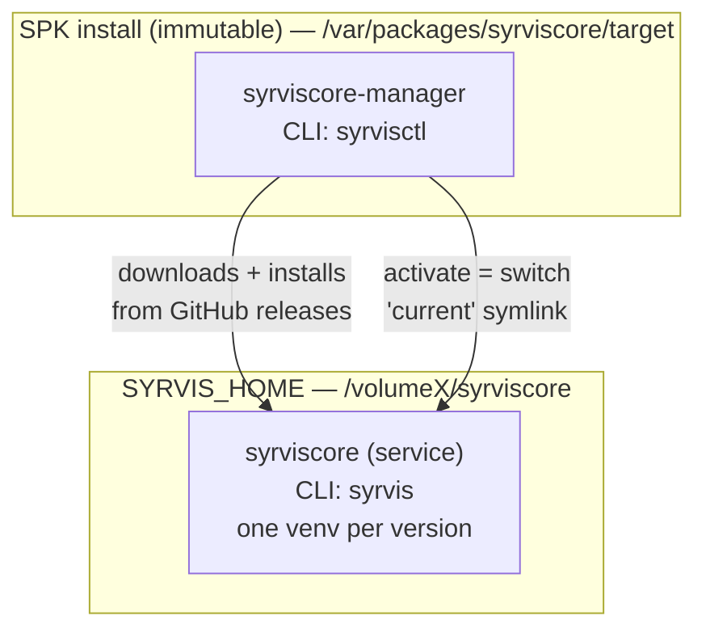
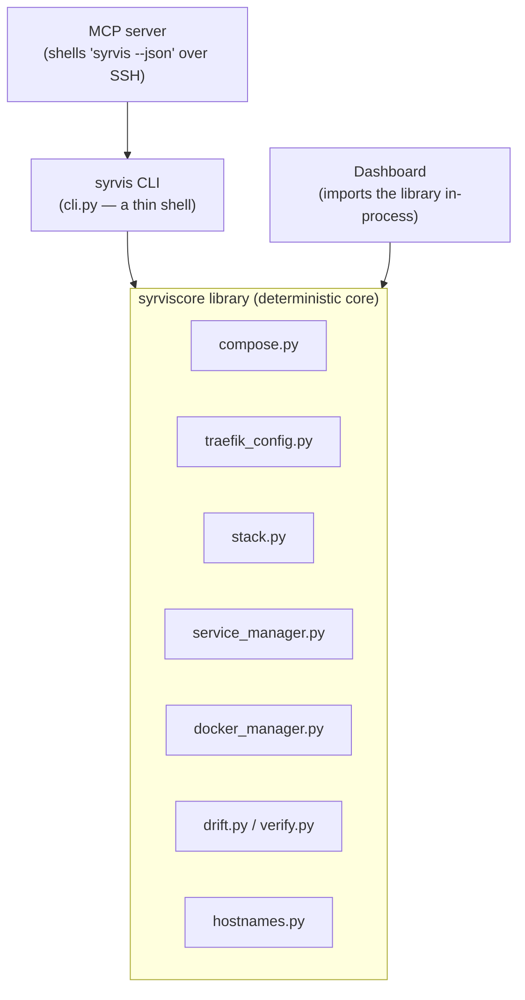

# Architecture Overview

SyrvisCore is built around one idea repeated at every layer: **a deterministic core, with thin
adapters over it.** This page explains the split-package layout, that principle, and how the three
adapters (CLI, MCP, dashboard) relate to the single library that does the real work.

---

## Split packages

SyrvisCore ships as **two** installable packages with very different update cadences:

| Package | CLI | Where | Updates | Job |
|---------|-----|-------|---------|-----|
| `syrviscore-manager` | `syrvisctl` | SPK dir (immutable) | Rare (SPK reinstall) | Version management: install / activate / rollback / backup / restore |
| `syrviscore` | `syrvis` | Per-version venv under `SYRVIS_HOME` | Frequent (`syrvisctl install`) | The actual Docker services and their config |

Why split? The manager is tiny and stable, so it rarely needs a privileged SPK reinstall. The service
changes often and is updated by the manager downloading a new versioned venv and flipping a symlink —
which also makes **rollback instant** (`current -> versions/<old>`).

Two more packages live in the monorepo but are **not** part of the SPK:

- `syrviscore-mcp` — the MCP server, runs on the **operator's Mac** (Python 3.10+).
- `syrviscore-dashboard` — the web UI, runs as a **container on the NAS** (Python 3.12).

---

## Deterministic core, thin adapters

The load-bearing principle. One tested library layer (`packages/syrviscore`) does the work — compose
generation, Traefik config, setup, Docker management, the stack model, Layer 2 services, drift,
doctor. Everything else is a thin adapter that calls into it:

The rule stated three ways, all equivalent:

> Anything an adapter can do, `ssh nas && syrvis …` can do. Library modules raise typed errors and
> never print; `cli.py` is the only presentation layer. Read commands emit `--json` — that is the
> machine contract the MCP and dashboard build on.

Concretely:

- **The CLI** (`syrvis`/`syrvisctl`) is a `click` shell that parses args, calls library functions,
  and renders results. Read commands support `--json`.
- **The MCP server** does not reimplement anything — it **shells out to `syrvis`/`syrvisctl --json`
  over SSH** and returns the parsed JSON. It re-queries state only for the few manager mutators that
  lack `--json`.
- **The dashboard** imports the library **in-process** (`read_config`, `DockerManager`,
  `ServiceManager`, the health probes) rather than duplicating logic.

This is why a bug fixed in the core is fixed for all three surfaces at once, and why the same
operation is reachable via a shell, an AI tool, and a browser.

---

## The MCP adapter, in a bit more depth

The MCP server is the "AI-facing" adapter, and it is the one with the most safety machinery, because
it lets a remote model drive a privileged host:

- Input is allow-listed and rejects shell metacharacters; a `--` separator stops any value becoming a
  flag; commands run with `shell=False`.
- A single command registry drives both the runtime argv **and** the generated sudoers + SSH shim, so
  they cannot drift (a test binds them).
- Mutating tools use a **two-call HMAC confirmation-token** handshake (per-process salt + state hash +
  single-use nonce + TTL), so a destructive action requires an explicit second, confirming call.
- Every call — including rejected/attacked ones — is written to an owner-only audit log.

See `docs/mcp-design.md` and `docs/mcp-security-review-2026-07.md` for the full model.

---

## Config sources of truth

Each concern has one home:

| Concern | Source of truth |
|---------|-----------------|
| Which core services run | `config/stack.yaml` |
| Secrets + network settings | `config/.env` |
| Docker image tags | `DEFAULT_DOCKER_IMAGES` in `compose.py` (pinned, no `:latest`) |
| Installed versions / active | `.syrviscore-manifest.json` + the `current` symlink |
| Per-service routing | `services/<name>/syrvis-service.yaml` |
| Required external DNS/tunnel state | *derived* — `syrvis stack hostnames` (never stored) |

---

## Where to go next

- The components themselves: [Primordial Substrate](02-primordial-substrate.md).
- How requests actually flow: [Networking](03-networking.md).
- Running your own services: [Layer 2 Services](05-layer2-services.md).
- Rebuilding after a failure: [Disaster Recovery](06-disaster-recovery.md).
