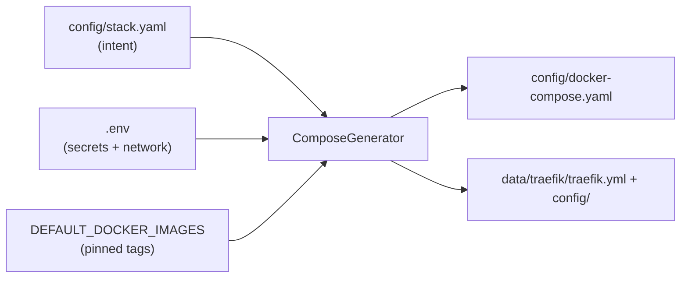
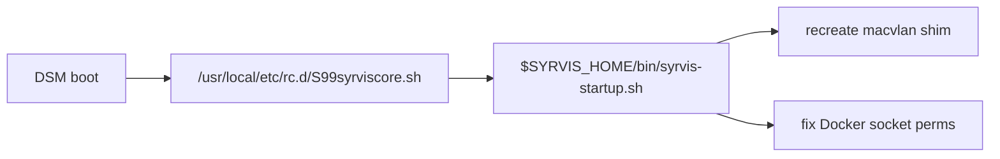

# The Primordial Substrate

The **primordial substrate** is the always-on core that SyrvisCore installs and owns — the layer
your own services ([Layer 2](05-layer2-services.md)) are built on top of. This page describes each
core component, how they are declared and generated, and the host-level plumbing (macvlan shim, boot
hooks) that keeps them working across reboots.

The substrate is declared in `config/stack.yaml` and materialized into `config/docker-compose.yaml`
by the compose generator (`syrviscore/compose.py`). Traefik configuration is generated separately
into `data/traefik/`.

---

## The declarative core stack (`stack.yaml`)

`config/stack.yaml` is the "declarative intent" surface for the core tier — the equivalent of a
`syrvis-service.yaml` for Layer 2. It records **which** core containers this instance runs:

```yaml
version: 1
services:
  traefik:        { enabled: true }            # primordial — cannot be disabled
  portainer:      { enabled: true }            # primordial — cannot be disabled
  cloudflared:    { enabled: true }            # optional
  dashboard:      { enabled: true, subdomain: dash }   # optional
  cloudflare_ddns:{ enabled: false }           # optional
```

- **Primordial** (`traefik`, `portainer`) are always on; the API refuses to disable them.
- **Optional** (`cloudflared`, `dashboard`, `cloudflare_ddns`) are opt-in and may carry
  generation-time settings (e.g. the dashboard's `subdomain`, per-service `exposure`).

`syrvis stack list` shows what's declared vs what's running; `syrvis stack enable/disable` edit the
file; `syrvis stack apply` regenerates compose (and Traefik config) from it.



Secrets and network settings live in `.env`; `stack.yaml` holds only enablement plus a few
generation knobs. Image tags are pinned in `DEFAULT_DOCKER_IMAGES` (in `compose.py`) — never
`:latest`.

---

## Traefik

The reverse proxy and the heart of the substrate. It is **primordial** and always present.

- **Dedicated macvlan IP** (`TRAEFIK_IP`) so it can bind `:80`/`:443` without fighting DSM's nginx.
  See [Networking](03-networking.md#the-two-networks).
- **Providers:** the Docker provider (labels on containers like Portainer/the dashboard) *and* the
  file provider (`/config`, watched) for Layer 2 services and Synology routes.
- **Config split:**
  - `data/traefik/traefik.yml` — **static** config: entrypoints, the `:8080` API + `/ping`, the
    Let's Encrypt resolver, logging. Read **only at process start**.
  - `data/traefik/config/` — **dynamic** config: per-service routers/services, hot-reloaded.
- **Certificates** in `data/traefik/acme.json` (`0600`), issued via DNS-01 or HTTP-01
  (see [Networking → TLS](03-networking.md#tls--certificate-issuance)).

> **The static-config restart invariant.** Because Traefik only reads `traefik.yml` at startup, a
> regenerated static file (e.g. one that newly enables `/ping`) has **no effect** until Traefik
> restarts — `docker compose up -d` will not restart a container just because a bind-mounted file
> changed. SyrvisCore centralizes all static-config writes through
> `docker_manager.write_traefik_config_files()`, which reports whether the static content changed,
> and callers (`syrvis start`, `stack apply`, `compose generate`, `config generate-traefik`) then
> call `restart_traefik_if_running()`. This is what keeps the dashboard's Traefik health probe from
> going "degraded: /ping 404" after a config regeneration.

The `:8080` API is `insecure: true` and reachable only inside the `proxy` network; the dashboard's
health probe reads `/ping` and `/api/overview` there.

---

## Portainer

A container-management web UI, also **primordial** — it is the fallback way to see and control
containers if the dashboard or CLI are unavailable. Routed by Traefik via Docker labels at
`portainer.<domain>`, backed by `:9000`. Its admin password can be seeded from
`config/.portainer-password` (`0600`) on first run. It mounts the Docker socket **read-only**.

---

## Cloudflared (optional)

The Cloudflare Tunnel connector — the ingress path for `tunnel`-exposed services and remote
management. It dials **outbound** to the Cloudflare edge using `CLOUDFLARE_TUNNEL_TOKEN`, so **no
inbound ports are opened** on your router.

- Runs on the `proxy` network so the tunnel's ingress can reach Traefik.
- Exposes its metrics/`/ready` server on `:20241` so the dashboard can report *real* tunnel
  connectivity (edge connections), not just "container up".
- The tunnel's **ingress rules and Access policies are managed by home-tech**, not SyrvisCore —
  SyrvisCore only reports which hostnames want a tunnel (`stack hostnames`).

See [Split DNS → tunnel](04-split-dns.md#tunnel--reachable-everywhere-via-cloudflare).

---

## The Dashboard (optional)

A FastAPI + React web app that is itself a **thin adapter** over the core library (it imports
`syrviscore` in-process — see [Architecture](01-architecture-overview.md)). It provides:

- a live health view (core containers, Traefik, Portainer, Cloudflared, DDNS, config) via SSE,
- a services panel (core stack + Layer 2), quick-links, logs, and update checks,
- optional container management (add/remove/start/stop) when explicitly enabled.

Security posture is deliberately conservative:

- The Docker socket is mounted **read-only** by default; read-write only when `management: true` is
  declared on the dashboard in `stack.yaml` (rw socket = host-level authority).
- `data`/`services` are mounted read-only unless management is declared.
- Auth modes: `none` (LAN-trusted), Cloudflare Access (consumes the `Cf-Access-Jwt-Assertion`
  header), or local OIDC SSO.

Its Traefik routers are named `syrvis-dashboard*` to avoid colliding with Traefik's own
file-provider `dashboard` router. Backed by `:8000`.

---

## Cloudflare DDNS (optional)

`favonia/cloudflare-ddns` keeps public DNS records pointed at your changing residential IP. Emitted
only when `CLOUDFLARE_API_TOKEN` is configured (otherwise the dashboard's DDNS probe reports
`not_configured`). Purely optional and independent of the tunnel.

---

## Host-level plumbing

The substrate needs two things on the **host** that a container image can't provide. `syrvis setup`
creates them, and — critically — makes them survive reboots automatically.

### The macvlan shim

As explained in [Networking](03-networking.md#why-the-shim-exists), Traefik on the macvlan network
can't reach the NAS host directly, so `syrvis setup` creates a `syrvis-shim` host interface at
`SHIM_IP`. `DockerManager.start_core_services()` also ensures it before bringing services up.

### Boot persistence

A reboot wipes the macvlan shim and Docker permissions, so SyrvisCore installs a boot hook:



| Artifact | Location | Purpose |
|----------|----------|---------|
| Startup script | `$SYRVIS_HOME/bin/syrvis-startup.sh` | Recreates the shim, sets Docker perms |
| Boot hook | `/usr/local/etc/rc.d/S99syrviscore.sh` | Runs the startup script at boot |
| Global CLI symlink | `/usr/local/bin/syrvis` | Puts `syrvis` on `PATH` |

These are created by `syrvis setup`'s privileged phase and recorded in
`.syrviscore-manifest.json`. This is a core project rule: **setup must leave a system that works
after a reboot with no manual steps.**

---

## Where things live on disk

```
/volumeX/syrviscore/                 # SYRVIS_HOME (auto-detected from the package volume)
├── current -> versions/0.3.2        # active service version (symlink switch = rollback)
├── versions/<v>/cli/venv/bin/syrvis
├── config/
│   ├── .env                         # secrets + network config
│   ├── stack.yaml                   # declared core stack
│   └── docker-compose.yaml          # generated
├── data/
│   ├── traefik/{traefik.yml, config/, acme.json, logs/}
│   ├── portainer/
│   └── cloudflared/
├── services/<name>/                 # Layer 2 definitions (see page 05)
├── compose/<name>.yaml              # Layer 2 generated compose
├── backups/                         # tar.gz archives (see page 06)
├── bin/{syrvis, syrvis-startup.sh}
└── .syrviscore-manifest.json
```
