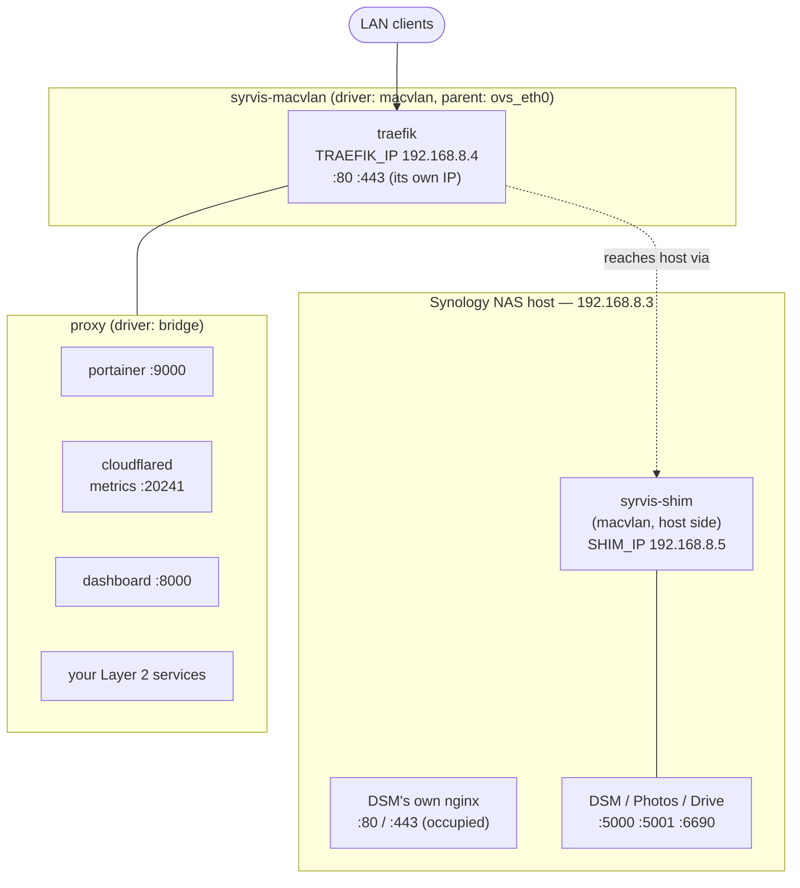
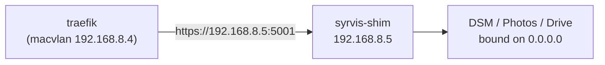
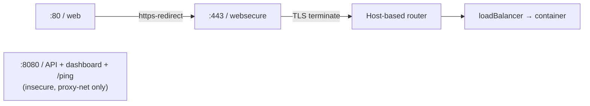
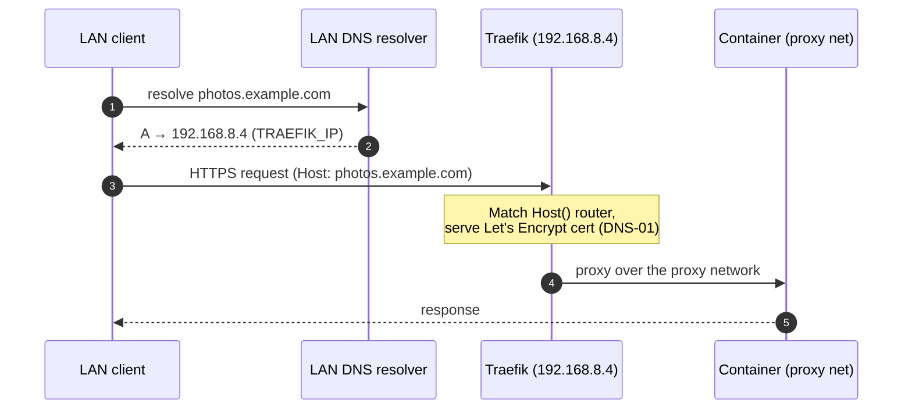
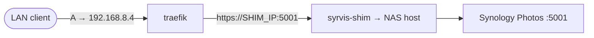
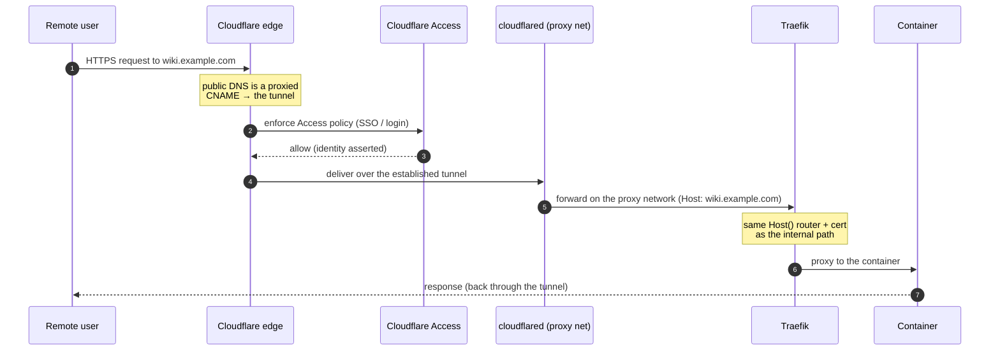
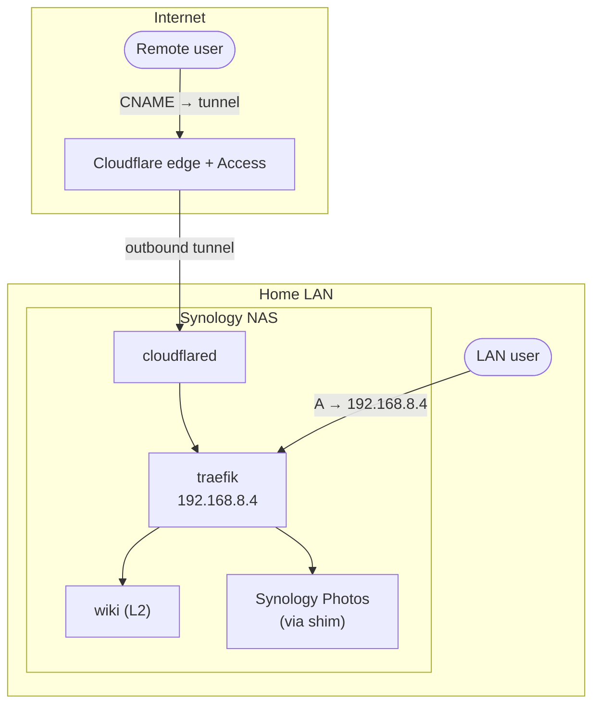
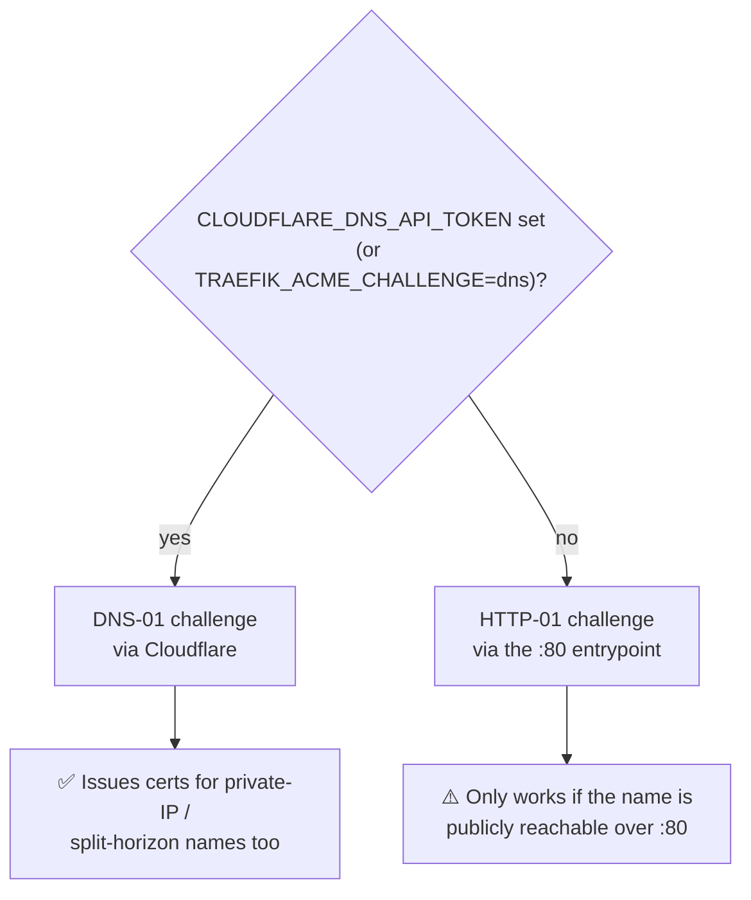

# Networking & Request Flow

This page traces a request from the outside world all the way to a container, in both of
SyrvisCore's exposure modes, and explains the two pieces of networking that make it work on a
Synology NAS: the **macvlan network** (so Traefik can own ports 80/443) and the **shim interface**
(so Traefik can still reach the NAS host).

For how the *same hostname* resolves differently depending on where the client is, see
[Split DNS](04-split-dns.md). For the containers themselves, see [Primordial Substrate](02-primordial-substrate.md).

---

## The two networks

Every SyrvisCore deployment has exactly two Docker networks:

- **`syrvis-macvlan`** — a `macvlan` network whose parent is the NAS's physical interface
  (`NETWORK_INTERFACE`, e.g. `ovs_eth0`). Traefik is given a **dedicated LAN IP** on it
  (`TRAEFIK_IP`, e.g. `192.168.8.4`). Because Traefik has its *own* IP, it can bind **ports 80 and
  443 without colliding with DSM's own nginx**, which already occupies those ports on the NAS's
  host IP. This is the crux of the whole design.
- **`proxy`** — an ordinary `bridge` network that every other container joins. Traefik is attached
  to it too, so it can forward to Portainer, the dashboard, Cloudflared, and your Layer 2 services
  by container name.

### Why the shim exists

A macvlan container **cannot talk to its own host** — that is a kernel limitation of macvlan, not a
SyrvisCore choice. So Traefik (on `syrvis-macvlan`) cannot reach services that live on the NAS
*host* (DSM, Synology Photos, Drive) at the host IP directly.

The fix is a **shim**: a second macvlan sub-interface created *on the host* (`syrvis-shim`) with its
own IP (`SHIM_IP`, conventionally `TRAEFIK_IP + 1`, e.g. `192.168.8.5`). Now the host is reachable
from the macvlan segment at `SHIM_IP`, and Traefik proxies Synology services to `https://SHIM_IP:5001`.
This works because DSM's system services bind `0.0.0.0`, so a packet arriving on the shim interface
is accepted. (`syrvis setup` creates the shim; a boot hook recreates it after reboot — see
[Primordial Substrate](02-primordial-substrate.md#boot-persistence).)

### Traefik's entrypoints

- **`web` (:80)** — every HTTP request is redirected to HTTPS by the `https-redirect` middleware.
- **`websecure` (:443)** — TLS is terminated here using a Let's Encrypt certificate, then the
  request is routed to a backend by its `Host(...)` rule.
- **`:8080`** — Traefik's API/dashboard and its `/ping` liveness endpoint. It is `insecure: true`
  and only reachable inside the `proxy` network (never published to the LAN); the SyrvisCore
  dashboard's health probe reads `/ping` and `/api/overview` here.

> **Static vs dynamic config.** `:8080`, the entrypoints, and the cert resolver live in Traefik's
> **static** config (`data/traefik/traefik.yml`), which Traefik reads **only at process start**.
> Per-service routing lives in the **dynamic** config (`data/traefik/config/`), which Traefik
> hot-reloads. This distinction matters: changing static config requires a Traefik **restart**, and
> SyrvisCore now does that automatically whenever it regenerates `traefik.yml` (see
> [Primordial Substrate → Traefik](02-primordial-substrate.md#traefik)).

---

## Request flow — `internal` exposure (LAN-only)

An `internal` service (the default) is reachable only from inside the network. The client resolves
the hostname to Traefik's LAN IP directly; **Cloudflare is not in the request path at all** (it is
used only to issue the certificate, via DNS-01).

The only external state an `internal` service needs is **one LAN DNS A record** pointing the
hostname at `TRAEFIK_IP`. `syrvis stack hostnames` reports exactly that record; home-tech creates it.

For a **Synology** service (DSM, Photos) the last hop goes through the shim instead of the proxy
network:

---

## Request flow — `tunnel` exposure (remote via Cloudflare)

A `tunnel` service is reachable from anywhere, gated by Cloudflare Access. No ports are forwarded on
your router; instead **Cloudflared holds an outbound tunnel** to the Cloudflare edge, and the edge
delivers authenticated requests back through it.

Key points:

- **No inbound ports.** `cloudflared` dials *out* to Cloudflare (`TUNNEL_TOKEN`), so nothing on your
  router is exposed. This is why `tunnel` works even behind CGNAT.
- **Access is the front door.** Every tunnel request is authenticated by a Cloudflare Access policy
  before it ever reaches the NAS. The dashboard can even consume the `Cf-Access-Jwt-Assertion`
  header for SSO.
- **Traefik still routes it.** The tunnel's ingress (configured by home-tech, not SyrvisCore) points
  at Traefik, so a `tunnel` service is routed and TLS-served by the *same* `Host()` router as an
  `internal` one. **SyrvisCore routes both exposures identically** — the difference is purely the
  external record home-tech must create (a proxied CNAME to the tunnel, plus an Access policy).

The whole picture, both planes at once:

---

## TLS / certificate issuance

Traefik issues Let's Encrypt certificates and stores them in `data/traefik/acme.json` (mode `0600`).
There are two challenge types, chosen automatically:

- **DNS-01 (recommended, and required for `internal`)** — Traefik proves domain control by writing a
  TXT record via the Cloudflare API (`CF_DNS_API_TOKEN`). This works **even when the hostname
  resolves to a private LAN IP**, which is exactly the split-horizon case for `internal` services.
  Set `CLOUDFLARE_DNS_API_TOKEN` in `.env` to enable it.
- **HTTP-01 (fallback)** — Let's Encrypt validates by fetching a token over the public Internet on
  port 80. For a private-IP name this **cannot succeed**, so without a DNS token an `internal`
  service will fall back to a default self-signed cert. If you route any `internal` host, set the
  DNS token.

---

## Quick reference — the `.env` knobs

| Variable | Meaning | Example |
|----------|---------|---------|
| `NETWORK_INTERFACE` | Physical parent for the macvlan | `ovs_eth0` |
| `NETWORK_SUBNET` | LAN subnet (CIDR) | `192.168.8.0/24` |
| `NETWORK_GATEWAY` | LAN gateway | `192.168.8.1` |
| `TRAEFIK_IP` | Traefik's dedicated LAN IP | `192.168.8.4` |
| `SHIM_IP` | Host shim IP (Traefik → host) | `192.168.8.5` |
| `NAS_IP` | The NAS's own host IP | `192.168.8.3` |
| `DOMAIN` | Base domain for all routes | `example.com` |
| `CLOUDFLARE_DNS_API_TOKEN` | Enables DNS-01 certs | *(secret)* |
| `CLOUDFLARE_TUNNEL_TOKEN` | Enables the Cloudflared tunnel | *(secret)* |

All of these are set by `syrvis setup` and consumed by the compose + Traefik config generators.
