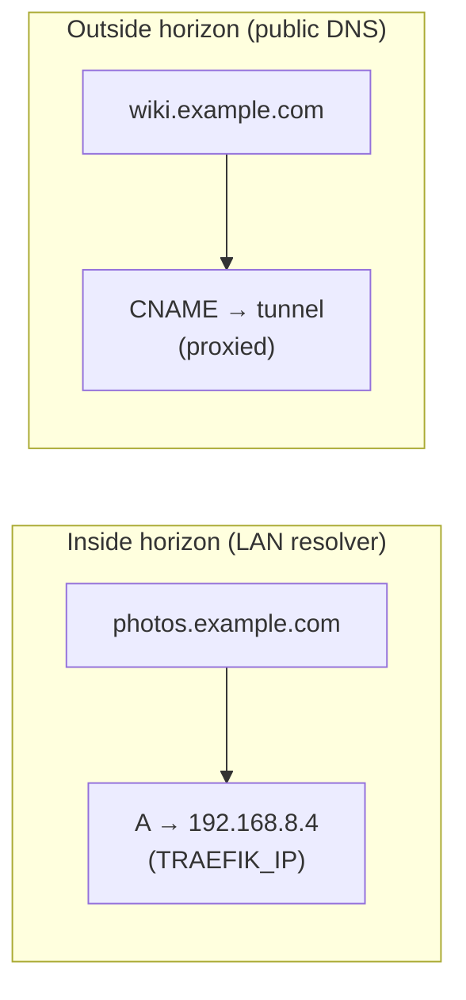
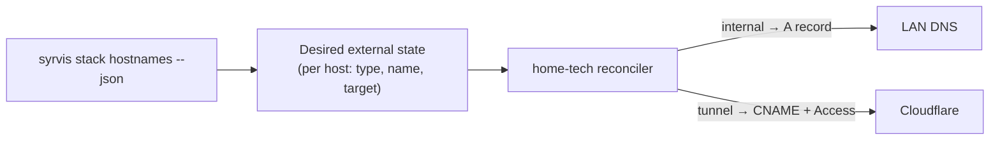
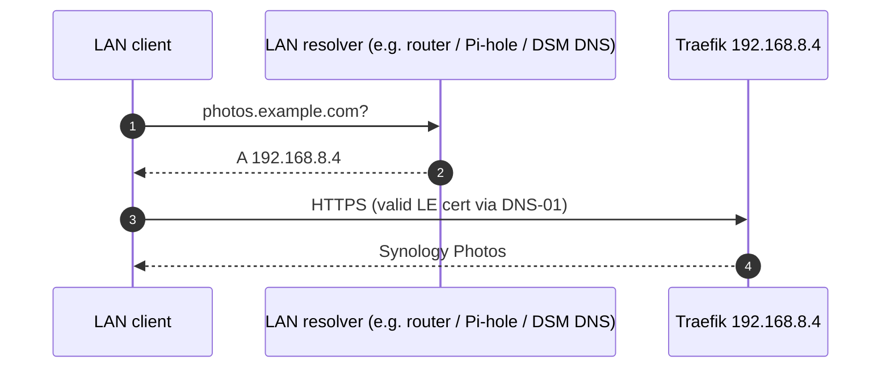
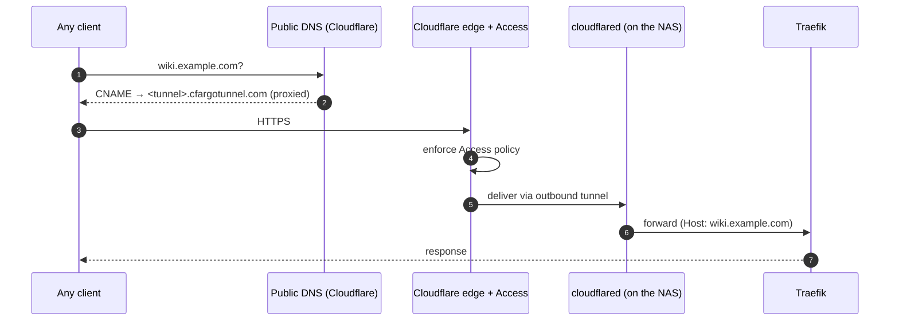
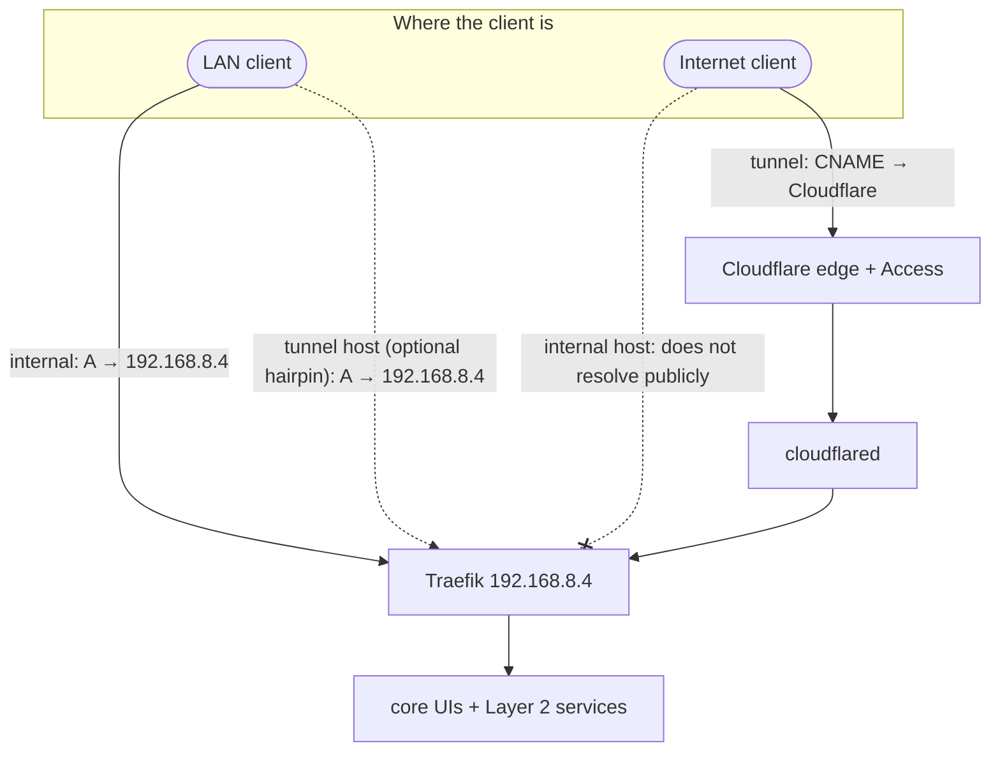

# Split DNS (Split-Horizon)

SyrvisCore is designed around **split-horizon DNS**: the *same* hostname (say `photos.example.com`)
deliberately resolves to **different answers depending on where the client is**. This page explains
why, how the two `exposure` modes map onto it, and exactly what records must exist — the state that
`syrvis stack hostnames` reports and that home-tech reconciles.

See also: [Networking & Request Flow](03-networking.md) for the packet-level path, and
[Layer 2 Services](05-layer2-services.md) for how a service declares its exposure.

---

## The core idea

A client on your LAN and a client on the public Internet should reach a service by **the same URL**,
but the network path is completely different:

- On the **LAN**, you want to go *straight* to Traefik at its local IP — fast, no round-trip to the
  cloud, no dependency on your uplink.
- From the **Internet**, there is no route to a private `192.168.x.x` address, so you must go through
  the Cloudflare tunnel.

Split DNS makes one hostname serve both. The two "horizons" are:

Which record a hostname needs is determined entirely by its **exposure**.

---

## Exposure → required record

| Exposure | Who can reach it | Record the outside world needs | Cert challenge |
|----------|------------------|-------------------------------|----------------|
| `internal` (default) | LAN only | **A** record `host → TRAEFIK_IP` on the **internal** resolver | DNS-01 |
| `tunnel` | Anywhere (behind Access) | **CNAME** `host → <tunnel>` (proxied) on **public** DNS + an Access policy | DNS-01 |

`syrvis stack hostnames --json` enumerates every routed hostname on the instance and emits precisely
this: for each host, its exposure and the concrete record to create. SyrvisCore itself creates none
of it — that is home-tech's job.

---

## `internal` — LAN-only, split-horizon

For an `internal` service the hostname must resolve, **on the LAN**, to `TRAEFIK_IP`. Publicly it
typically does not resolve at all (or resolves to nothing useful). The certificate is still a real,
publicly-trusted Let's Encrypt cert, issued via **DNS-01** — which is why DNS-01 is mandatory here:
HTTP-01 can't validate a name that only points at a private IP.

**How the LAN resolver gets that answer** is a home-tech concern, and there are a few common patterns:

- A local DNS server (Pi-hole, AdGuard, `dnsmasq`, or the router) with an override/A record for the
  host (or a wildcard `*.example.com → TRAEFIK_IP`).
- DSM's own DNS Server package hosting the internal zone.
- A split-horizon setup where the same zone is served with private answers internally and public
  answers (or none) externally.

The point SyrvisCore cares about: it *reports* "`photos.example.com` needs `A → 192.168.8.4`", and
home-tech makes it so.

---

## `tunnel` — reachable everywhere, via Cloudflare

For a `tunnel` service the **public** DNS record is a **proxied CNAME** pointing at the Cloudflare
Tunnel, and a Cloudflare Access policy guards it. The request never touches your router's inbound
ports (see [Networking](03-networking.md#request-flow--tunnel-exposure-remote-via-cloudflare)).

A `tunnel` service can *also* be reachable on the LAN if you additionally publish an internal A
record for it — a "hairpin" — but that is optional and, again, home-tech's decision.

---

## Putting it together

- **LAN client, `internal` host** → straight to Traefik. ✅
- **LAN client, `tunnel` host** → resolves to Cloudflare (or, with a hairpin record, straight to
  Traefik). ✅
- **Internet client, `tunnel` host** → Cloudflare edge → Access → tunnel → Traefik. ✅
- **Internet client, `internal` host** → does not resolve publicly; unreachable **by design**. 🔒

---

## Why keep DNS out of SyrvisCore?

Because the DNS/Cloudflare state is inherently **site-specific** (your domain, your accounts, your
resolver), and SyrvisCore is meant to stay **generic and reusable**. By declaring intent (`exposure`)
and reporting the required records rather than creating them, SyrvisCore:

- carries no secrets or account bindings for DNS/Cloudflare,
- can be open-sourced and shared without leaking a homelab's topology,
- gives home-tech a clean, machine-readable contract (`stack hostnames --json`) to reconcile against.

This separation — **SyrvisCore declares, home-tech reconciles** — is the same seam that the
[provisioning design](home-tech-provisioning-requirement.md) builds on.
