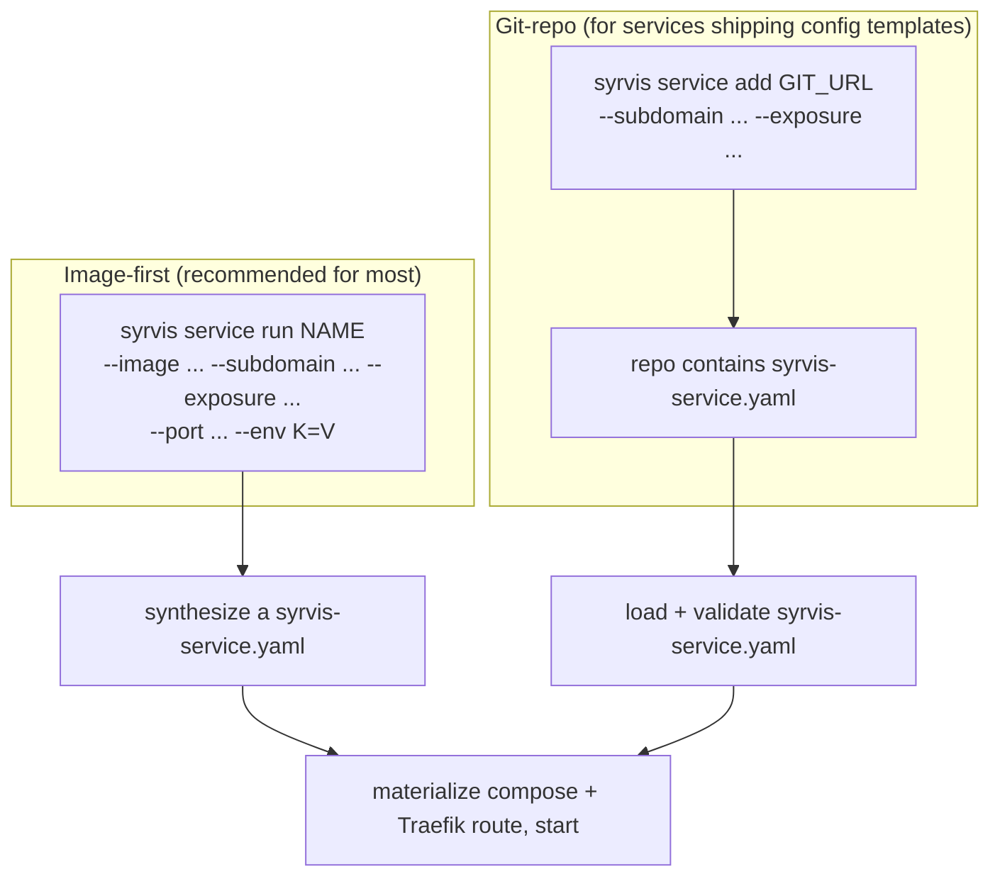
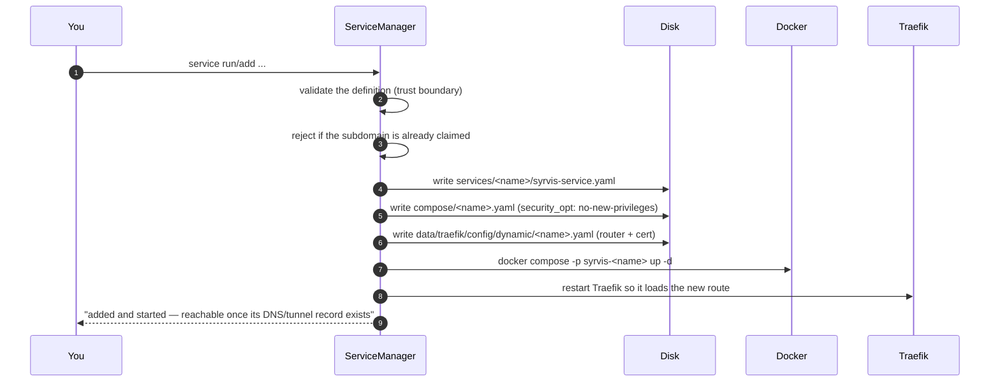

# Layer 2 Services

**Layer 2** is where SyrvisCore earns its keep: running *your* containers — a wiki, an uptime
monitor, a home-automation hub — behind the same Traefik routing, TLS, and (optionally) Cloudflare
Access that the core stack uses. The goal is that adding a service is close to trivial.

This page is the practical guide. For the exhaustive field list see the
[`syrvis-service.yaml` Reference](07-service-schema-reference.md).

---

## Two ways to add a service



Both paths converge on the **same** on-disk artifact — a validated `syrvis-service.yaml`, a generated
`compose/<name>.yaml`, and a Traefik dynamic-config file — and run each service as its **own isolated
compose project** (`-p syrvis-<name>`).

### Image-first — `syrvis service run`

The simplest path. You hand SyrvisCore an image and how to route it; it synthesizes the manifest:

```bash
syrvis service run uptime-kuma \
  --image louislam/uptime-kuma:1.23.16 \
  --subdomain status \
  --exposure tunnel \
  --port 3001 \
  --env UPTIME_KUMA_DISABLE_FRAME_SAMEORIGIN=1
```

Best for the common case: a single published image you just want routed. No git repo to maintain, and
no arbitrary code cloned as root.

### Git-repo — `syrvis service add`

For services that ship **config templates** or a richer, version-controlled manifest, put a
`syrvis-service.yaml` in a git repo and:

```bash
syrvis service add https://github.com/you/my-service.git \
  --subdomain wiki --exposure internal
```

The repo is shallow-cloned (over an allowlisted transport), its manifest validated through the same
trust boundary as the image-first path, and installed. `--subdomain`/`--exposure` override the
manifest at enable time. Reach for this only when the service genuinely needs the extra expressiveness
(templates, custom middlewares); otherwise prefer `service run`.

---

## What "adding a service" actually does



Every step rolls back on failure, so a failed install never leaves partial state that blocks a retry.

---

## Exposure and reachability — the part people miss

Adding a service makes it **routable**, but not necessarily **reachable** yet: the outside world
still needs a DNS/tunnel record, which SyrvisCore reports but does not create (see
[Split DNS](04-split-dns.md)). The success message tells you which case you're in:

- **routed** (`traefik.enabled`, a subdomain set): *"reachable once its DNS/tunnel record exists; run
  `syrvis stack hostnames` for the exact record."*
- **not routed** (a git manifest with no `traefik:` block): *"installed but NOT routed — unreachable
  via Traefik."* — a deliberate, honest warning so a service that will 404 doesn't look "successful".

Then:

```bash
syrvis stack hostnames          # shows the exact A / CNAME record each host needs
```

…and home-tech reconciles that record. For `internal` that's a LAN A record → `TRAEFIK_IP`; for
`tunnel` it's a proxied CNAME + a Cloudflare Access policy.

---

## Guardrails (the trust boundary)

A `syrvis-service.yaml` from a third-party repo is **attacker-controlled input** that becomes
filesystem paths and a compose file that root starts. The schema is therefore strict — see the
[reference](07-service-schema-reference.md) for the full list, but the load-bearing rules are:

- **Names** are a narrow charset (`[a-z0-9][a-z0-9_-]{0,63}`) and may not impersonate a core service
  (`traefik`, `portainer`, `cloudflared`, `proxy`, `syrvis-macvlan`).
- **Images must be pinned** — a specific tag or `@sha256` digest, never `:latest`.
- **Volumes** may only be named volumes or paths **relative to the service's own data dir**; absolute
  host paths, `..`, `$`-expansions, and the Docker socket are all rejected.
- **Unknown keys are rejected** outright, so a manifest can't smuggle `privileged`, `cap_add`,
  `network_mode`, `devices`, etc.
- Every container gets `security_opt: no-new-privileges:true`.
- **Subdomain collisions are rejected** at add time (two services can't claim the same host).

---

## Configuring a service

Routing gets a service *reachable*; two more things get it *working* — its
environment and its persistent storage. Both are declared in the manifest (or as
flags on `service run`), and both have a sharp edge worth knowing.

### Environment variables

The container's config almost always comes from env vars. Declare them inline:

```yaml
environment:
  - "APP_MODE=production"
  - "LOG_LEVEL=info"
```

…or pass them on the image-first path (repeat `--env` per variable):

```bash
syrvis service run myapp \
  --image ghcr.io/example/myapp:1.4.0 --subdomain app --exposure internal --port 8080 \
  --env APP_MODE=production --env LOG_LEVEL=info
```

Each entry must be `KEY=VALUE` with `KEY` matching `[A-Za-z_][A-Za-z0-9_]*` — a
bare `KEY` (pass-through-from-host) is **rejected**, because a service must not
silently inherit the host environment. A manifest that carries inline
`environment:` is written `0600` (the values may be secrets).

**Secrets belong in `env_file`, not the manifest.** Point at a data-dir-relative
file; it is created empty and clamped to `0600` at install, and never leaves the
NAS:

```yaml
env_file: "secrets.env"     # → $SYRVIS_HOME/data/<name>/secrets.env, 0600
```

> **Verify the env actually took — a service can come up "healthy" but
> mis-configured.** Some images *silently* fall back to a built-in demo/sample
> mode when a required variable is unset: the container is `running`, Traefik is
> green, the health endpoint returns 200 — and every value it serves is fake.
> After any install or update, check the app's own health/status endpoint, not
> just container state. Green ≠ configured.

### Persistent data volumes

Anything a service must keep across a restart or an image update — a database, an
upload dir — needs a declared volume. Use a **relative** host path; it resolves
under the service's own data dir (`$SYRVIS_HOME/data/<name>/`) and survives
updates:

```yaml
volumes:
  - "data:/data:rw"          # → $SYRVIS_HOME/data/<name>/data  mounted at /data
```

On the image-first path: `--volume data:/data:rw`.

Three things SyrvisCore handles so a bind mount actually works on DSM:

1. **The host directory is pre-created.** DSM's Docker refuses to auto-create a
   bind-mount source, so `up` would fail with *"Bind mount failed: … does not
   exist"*. SyrvisCore `mkdir`s it first.
2. **`rw` dirs are made world-writable (`0777`).** Most images run as a
   non-root UID; a root-owned host dir would shadow the image's volume and the app
   would crash-looping-fail to write. `0777` is the pragmatic fix today (a
   narrower, per-service `user:`/PUID field is on the [roadmap](service-declaration-v2.md)).
   `ro` mounts get no write bit.
3. **`start` self-heals volume-dir drift.** `syrvis service start <name>`
   regenerates the compose file first, so a directory that was pruned or
   re-permissioned out from under a service is re-created before the container
   comes up.

> **Why relative, not a named volume, for data you care about:** a service that
> declares no volume (or an anonymous one) loses its data to a fresh anonymous
> volume on **every** update. The relative bind under `data/<name>/` is the
> durable, backed-up-by-DR location — see [Disaster Recovery](06-disaster-recovery.md).

---

## Declarative loading — `services.d/` + `reconcile`

Everything above is imperative (`service run/add/remove`). The **declarative**
model — the one built for infrastructure-as-code, driven by an external
deployment repo, an agent, or CI — is a directory of one-service-per-file
declarations that SyrvisCore reconciles reality to:

```
$SYRVIS_HOME/config/services.d/
├── myapp.yaml          # filename (minus .yaml) IS the service name
└── uptime-kuma.yaml
```

Each file is a full `syrvis-service.yaml` plus two orchestration keys:

```yaml
name: myapp
image: ghcr.io/example/myapp:1.4.0
enabled: true      # false → declared but not run (kept in the desired set)
critical: false    # true → its failure makes the whole stack unhealthy
traefik: { enabled: true, subdomain: app, port: 8080, exposure: internal }
environment: ["APP_MODE=production"]
volumes: ["data:/data:rw"]
```

Then converge:

```bash
syrvis reconcile --dry-run       # side-effect-free plan (load → plan → apply)
syrvis reconcile -y              # apply it
syrvis reconcile --prune remove  # additionally remove installed-but-undeclared services
```

The engine's guarantees are what make this safe to drive from a script or an agent:

- **Per-file, per-service failure isolation** — a non-critical service that fails
  to come up is reported `degraded` and **never blocks the rest**; only a
  `critical` failure makes the run unhealthy.
- **An invalid file fails the run loudly** (fatal by default) — a malformed
  declaration is never silently skipped.
- **`reconcile` without `--prune` never removes anything** — deleting a file
  *undeclares* a service (reported `unmanaged`); actual teardown stays an explicit
  `--prune` choice.
- **The boot hook runs `reconcile --boot`**, so the declared set is restored after
  a NAS reboot with no manual step.

This is the seam an external deployment repo drives: it keeps `services.d/` under
version control, pushes it to the NAS (e.g. over `tar`-over-`ssh`), and runs
`reconcile` — no MCP required, though the MCP's `reconcile`/`service_declare` tools
drive the same steps when an agent does it instead.

> **Transport note:** the MCP `service_declare` tool today carries only
> image/subdomain/exposure/port/enabled/critical — **not** `environment` or
> `volumes`. A declaration that needs either is therefore **file-pushed** (its
> `.yaml` copied into `services.d/`, then reconciled) rather than expressed as a
> single tool call. See the [roadmap](service-declaration-v2.md) for closing that
> gap.

---

## Lifecycle commands

```bash
syrvis service list              # installed services (name/version/status/url/exposure)
syrvis service start <name>
syrvis service stop <name>
syrvis service update <name>     # git services: pull + reconcile + restart if the image changed
syrvis service remove <name>     # add --purge to also delete its data
```

Each service is isolated in its own compose project, so `remove` of one never disturbs another. Note
that **removing a service deletes its route immediately** but preserves its data unless you `--purge`.

---

## The service catalog

The fastest path of all — vetted, version-pinned templates make common services one word:

```bash
syrvis service catalog            # list templates (bundled + $SYRVIS_HOME/catalog/)
syrvis service run gollum         # resolve from the catalog, install, route
syrvis service run gollum --subdomain notes --exposure tunnel   # with overrides
```

Bundled templates ship inside the wheel; drop your own `<name>.yaml` (an ordinary
`syrvis-service.yaml`) into `$SYRVIS_HOME/catalog/` to add or override one. Every
template is validated through the same trust boundary at resolve time.

## Whole-set convergence (`stack apply --from`)

For declarative management (the home-tech seam), one document can declare the
*entire* intended state — core stack enablement plus the complete L2 set — and
SyrvisCore converges to it:

```bash
syrvis stack apply --from desired.yaml --dry-run   # side-effect-free plan
syrvis stack apply --from desired.yaml -y --json   # apply (destructive gated)
```

Services absent from the document follow its `on_undeclared: stop|remove|purge`
policy (default `stop` — never destructive by default). `syrvis verify` also
reports Layer 2 drift (a declared service that is stopped or running the wrong
image), and `verify --fix` restarts it.

## Current limitations (be aware)

The single-container, HTTP-through-Traefik model is deliberately simple. Today it does **not** support:

- **Multi-container services / sidecars** — `depends_on` is rejected, because each service is its own
  compose project (a `depends_on` could only ever reference a service in the same project).
- **Non-HTTP services** — everything is routed through Traefik's HTTP entrypoints; there is no host
  port publishing or TCP/UDP entrypoint, so a service whose only interface isn't HTTP can't be
  exposed yet.

Richer declarations landed with schema v2: `healthcheck`, `env_file` (0600 secrets
out of the manifest), and `resources` — see the [schema reference](07-service-schema-reference.md).
The remaining roadmap lives in the [next-iteration design](service-declaration-v2.md).

---

## A worked example

```bash
# A LAN-only wiki:
syrvis service run gollum \
  --image gollum/gollum:v5.3.2 \
  --subdomain wiki --exposure internal --port 4567

syrvis stack hostnames
#  wiki.example.com   internal   A → <TRAEFIK_IP>   (create this on your LAN resolver)

# ...once the A record exists, then:
open https://wiki.example.com     # from the LAN
```

See the shipped `examples/` directory for `internal` and `tunnel` sample definitions.
