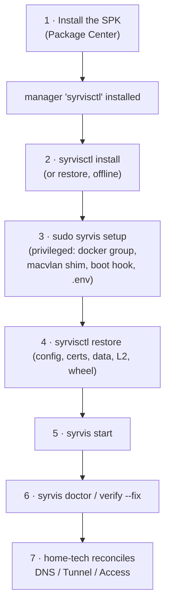
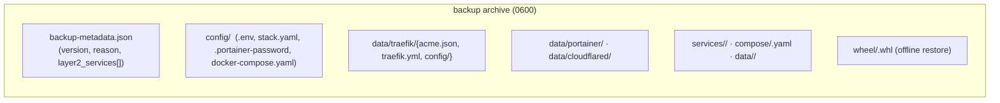

# Disaster Recovery

This page is the runbook for rebuilding a SyrvisCore NAS from scratch — a wiped volume, a replaced
unit, or a corrupted install — and an honest accounting of what the backup does and does not capture.

The design goal: **everything reproducible, no manual out-of-band steps** beyond the few that are
inherently privileged/interactive (SPK install, first `syrvis setup`).

---

## The DR sequence



The **ordering matters** and is easy to get wrong:

1. **Install the SPK** → gives you `syrvisctl` (the manager). It's self-contained (bundled wheels,
   no network needed).
2. **`syrvisctl install`** → downloads and installs the service version. In a real disaster with no
   internet, prefer **restore from a backup** (which carries a cached wheel and installs fully
   offline) or install from a local `--wheel`.
3. **`sudo syrvis setup`** → the privileged, host-level state: docker-group membership, the macvlan
   shim, the S99 boot hook, and the generated `.env`. **This is NOT in any backup** and must be run
   on a bare box, before/around restore, or Traefik cannot bind its IP and services won't survive a
   reboot.
4. **`syrvisctl restore <backup>`** → repopulates `config/` (incl. `.env`, `stack.yaml`, secrets),
   the core `data/` (certs, Portainer, Cloudflared), **and your Layer 2 services** (definitions,
   compose, and per-service data). It rebuilds the version venv from the cached wheel and verifies it
   *before* switching the `current` symlink.
5. **`syrvis start`** → brings the stack up.
6. **`syrvis doctor` / `verify --fix`** → confirms health and reconciles any container-level drift.
7. **home-tech reconciles DNS/Tunnel/Access** from `syrvis stack hostnames` — the outside world still
   needs its records (see [Split DNS](04-split-dns.md)).

> `syrvisctl restore` prints exactly this reminder in its "Next steps", including that docker-group,
> the macvlan shim, and the boot hook come from `syrvis setup`, not the backup.

---

## What the backup captures

`syrvisctl backup` writes a `0600` `tar.gz` under `backups/`. It captures:



| Captured | Notes |
|----------|-------|
| `config/` (all of it) | `.env` (all tokens), `stack.yaml`, `.portainer-password`, the generated compose |
| `data/traefik/acme.json` | Issued certs (clamped to `0600` on restore) |
| `data/traefik/traefik.yml` + `config/` | Static + dynamic Traefik config |
| `data/portainer/`, `data/cloudflared/` | Core service state incl. the tunnel credentials |
| **`services/<name>/`, `compose/<name>.yaml`, `data/<name>/`** | **Every Layer 2 service** — definitions, generated compose, and per-service data |
| `wheel/<version>.whl` | The cached wheel, so restore works **fully offline** |
| `backup-metadata.json` | Includes a `layer2_services` inventory, surfaced in the restore summary |

Backups are created automatically **before every upgrade** (a pre-upgrade backup is the rollback
point; a failed pre-upgrade backup now **aborts the upgrade** unless you pass `--no-backup`) and after
a successful `setup` (a `-N`-suffixed post-setup backup).

---

## What the backup does NOT capture (and how to recover it)

| Not in the backup | Why | Recovery |
|-------------------|-----|----------|
| docker-group membership, macvlan shim, S99 boot hook | Host-level privileged state, not files under `SYRVIS_HOME` | `sudo syrvis setup` |
| The Docker **images** themselves | Pulled from registries, not bundled | `syrvis start` / `service start` re-pulls pinned tags |
| DNS / Cloudflare Tunnel / Access config | Deliberately outside SyrvisCore's boundary | home-tech reconciles from `stack hostnames` |
| Secrets, **if the only backup was on the wiped volume** | A 0600 archive on the dead disk is gone with it | Keep a backup **off-box** (see below) |

### Secrets that are unrecoverable without an off-box backup

These live in `config/.env` (and `config/.portainer-password`) and **are** in the backup — but if
your only backup died with the volume, they must be regenerated:

- **Cloudflare Tunnel token** — must be re-minted in Cloudflare (cannot be re-derived).
- **DNS-01 / DDNS API tokens** — re-supply them; certs then re-issue automatically.
- **OIDC client secret**, **dashboard session secret**, **Portainer admin password** — regenerate.

**Action:** copy the latest `backups/*.tar.gz` **off the NAS** on a schedule (Synology Hyper Backup,
`rsync`, or an object store). The archive is already `0600` and self-contained.

---

## Reproducibility notes

- **Offline restore is the primary DR path.** The backup's cached wheel means restore needs no
  network; the `syrvisctl install`-from-GitHub path is the *convenience* path and depends on GitHub
  being reachable (set `GITHUB_TOKEN` to avoid anonymous rate limits during recovery).
- **The dev/rebuild loop is CI-tested.** The `dev-loop` job builds the devkit tarball and bootstraps
  a complete install from it (real venvs, real pip, offline manager install) — the same flow as
  `make nas-dev`.
- **Rollback is instant** and separate from DR: `syrvisctl rollback` switches the `current` symlink
  to a previous version (restoring its config/data from that version's backup).

---

## One-screen cheat sheet

```bash
# On a rebuilt NAS, in order:
#   (Package Center) install the SyrvisCore SPK
sudo syrvis setup                          # privileged host state (shim, boot hook, docker group)
syrvisctl restore /path/to/backups/0.3.2.tar.gz   # offline: config + certs + data + L2 + wheel
syrvis start                               # bring the stack up
sudo syrvis verify --fix                   # heal any container drift
syrvis stack hostnames                     # → hand to home-tech to reconcile DNS/Tunnel/Access
```
