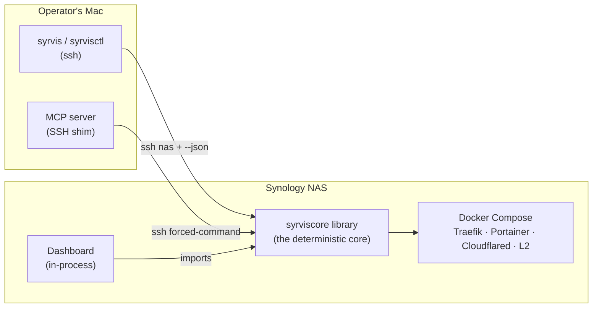

# SyrvisCore Wiki

The engineering handbook for SyrvisCore — the self-hosted infrastructure platform that
turns a single Synology NAS into a routed, authenticated, remotely-manageable service host
using Traefik, Cloudflared, Portainer, and a web dashboard.

> **Who this is for.** Operators running SyrvisCore, and engineers extending it. It assumes
> you know Docker and basic networking, but explains everything SyrvisCore-specific from first
> principles.

## Map of the wiki

| Page | What it covers |
|------|----------------|
| [01 · Architecture Overview](01-architecture-overview.md) | The split-package design, the "deterministic core, thin adapters" principle, and how the CLI, MCP server, and dashboard relate. |
| [02 · The Primordial Substrate](02-primordial-substrate.md) | The always-on core: Traefik, Portainer, Cloudflared, the dashboard, the macvlan network + shim, and boot persistence. |
| [03 · Networking & Request Flow](03-networking.md) | End-to-end request paths (Internet → Cloudflare → router → Traefik → container), the macvlan model, entrypoints, and TLS/cert issuance. Diagram-heavy. |
| [04 · Split DNS (Split-Horizon)](04-split-dns.md) | Why the same hostname resolves differently on the LAN vs the public Internet, and how `internal` vs `tunnel` exposure drive it. |
| [05 · Layer 2 Services](05-layer2-services.md) | The guide to adding your own containers: image-first vs git-repo, the `syrvis-service.yaml` schema, exposure, and the reachability contract. |
| [06 · Disaster Recovery](06-disaster-recovery.md) | Rebuilding the NAS from scratch: SPK → install → setup → restore, what the backup does and does not capture, and the ordering that matters. |
| [07 · `syrvis-service.yaml` Reference](07-service-schema-reference.md) | Every field a Layer 2 service definition may declare, the security rules, and worked examples. |

## The 60-second model

One tested Python library does the work. Three thin adapters — the **CLI**, the **MCP server**,
and the **web dashboard** — sit over it. Anything an adapter can do, `ssh nas && syrvis …` can do.

## Two tiers of service

- **Core / primordial tier** — the routing and management substrate SyrvisCore installs and owns:
  Traefik, Portainer, Cloudflared, the dashboard, optional Cloudflare DDNS. Declared in
  `config/stack.yaml`. See [02 · Primordial Substrate](02-primordial-substrate.md).
- **Layer 2 tier** — the services *you* run on top (a wiki, a monitor, a home-automation hub).
  Declared per-service in a `syrvis-service.yaml`. See [05 · Layer 2 Services](05-layer2-services.md).

## The one rule that explains the boundaries

**SyrvisCore never touches DNS or the Cloudflare API.** It *declares* what it routes and how each
host is meant to be reached (`internal` = LAN-only, `tunnel` = remote), and reports the concrete
external record each hostname needs via `syrvis stack hostnames`. A neighbouring deployment repo
(**home-tech**) reads that report and reconciles the outside world (DNS, Tunnel, Access). This keeps
SyrvisCore generic — no domain, IPs, or accounts live in it — and is why [Split DNS](04-split-dns.md)
is a first-class concept here.
